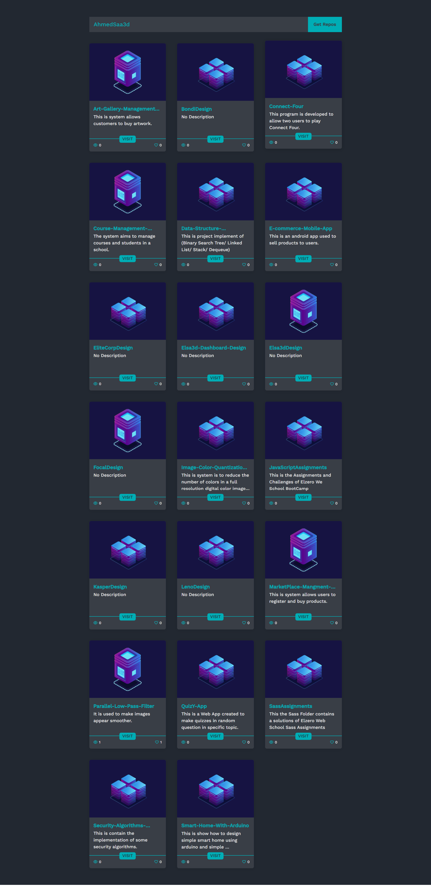
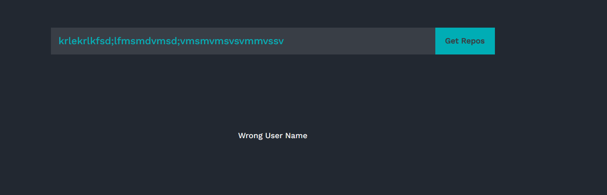

# Repos-App
This is a Web App created to get GitHub username and display its repos in new responsive way design
# Covered Topics :
- html5
- css3
- javaScript
- Es6
- Dom - Bom - Json - API
# Site ScreenShot :

